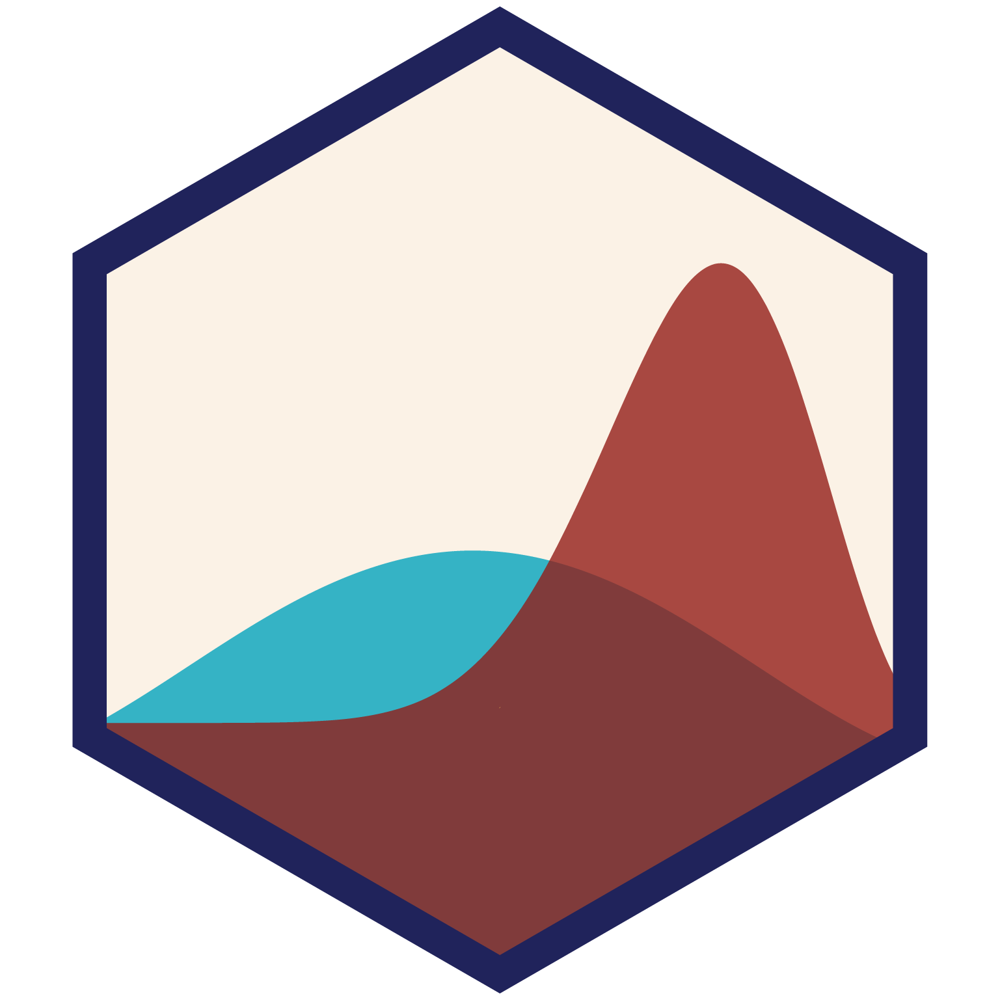

<!-- README.md is generated from README.qmd. Please edit that file -->

# Bayesian Statistics Readings <a href='https://bayesf22.classes.andrewheiss.com/'></a>

[Andrew Heiss](https://www.andrewheiss.com/) and [Meng
Ye](https://aysps.gsu.edu/phd-student/ye-meng/)  
[PMAP 8911 • Fall 2022](https://bayesf22.classes.andrewheiss.com/)  
Andrew Young School of Policy Studies • Georgia State University

------------------------------------------------------------------------

## How to build the site

1.  Install
    [RStudio](https://www.rstudio.com/products/rstudio/download/#download)
    version 2022.07.1 or later since it has a
    [Quarto](https://quarto.org/) installation embedded in it.
    Otherwise, download and install [Quarto](https://quarto.org/)
    separately.
2.  Open `bayesf22.Rproj` to open an [RStudio
    Project](https://r4ds.had.co.nz/workflow-projects.html).
3.  If it’s not installed already, R *should* try to install the [{renv}
    package](https://rstudio.github.io/renv/) when you open the RStudio
    Project for the first time. If you don’t see a message about package
    installation, install it yourself by running
    `install.packages("renv")` in the R console.
4.  Run `renv::restore()` in the R console to install all the required
    packages for this project.
5.  Run `targets::tar_make()` in the R console to build everything.
6.  🎉 All done! 🎉 The complete website will be in a folder named
    `_site/`.

## {targets} pipeline

We use the [{targets} package](https://docs.ropensci.org/targets/) to
build this site and all its supporting files. The complete pipeline is
defined in [`_targets.R`](_targets.R) and can be run in the R console
with:

``` r
targets::tar_make()
```

The pipeline does a few major tasks:

-   **Run long-running Bayesian scripts**: Bayesian computation with
    MCMC sampling takes a long time. Instead of running our models in
    `.qmd` files that are re-run when rendering the website, we run them
    in separate `.R` files (located in [`R/`](R/)) and show their
    results in their corresponding `.qmd` files.

-   **Build Quarto website**: This project is a [Quarto
    website](https://quarto.org/docs/websites/), which compiles and
    stitches together all the `.qmd` files in this project based on the
    settings in [`_quarto.yml`](_quarto.yml). See the [Quarto website
    documentation](https://quarto.org/docs/websites/) for more details.

The complete pipeline looks like this:

<small>(This uses [`mermaid.js`
syntax](https://mermaid-js.github.io/mermaid/) and should display as a
graph on GitHub. You can also view it by pasting the code into
<https://mermaid.live>.)</small>


## Licenses

**Text and figures:** All prose and images are licensed under Creative
Commons ([CC-BY-NC
4.0](https://creativecommons.org/licenses/by-nc/4.0/))

**Code:** All code is licensed under the [MIT License](LICENSE.md).
